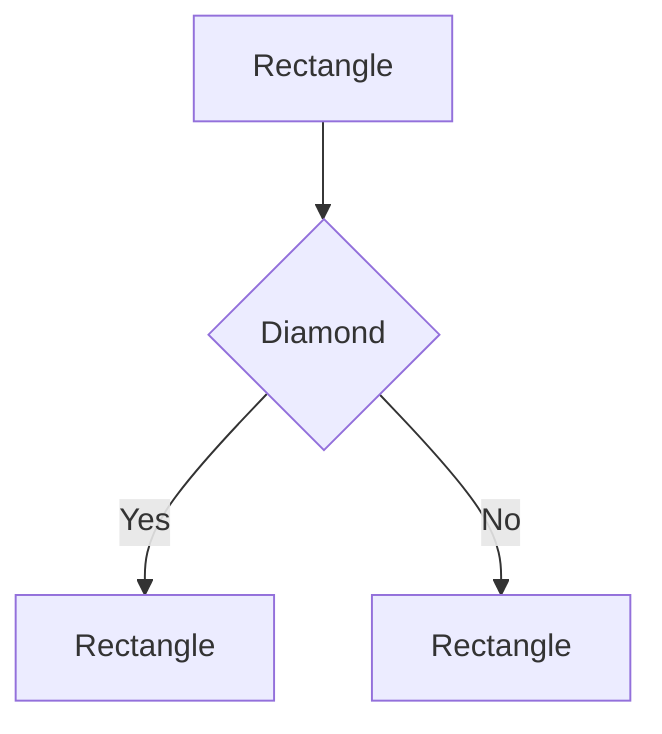
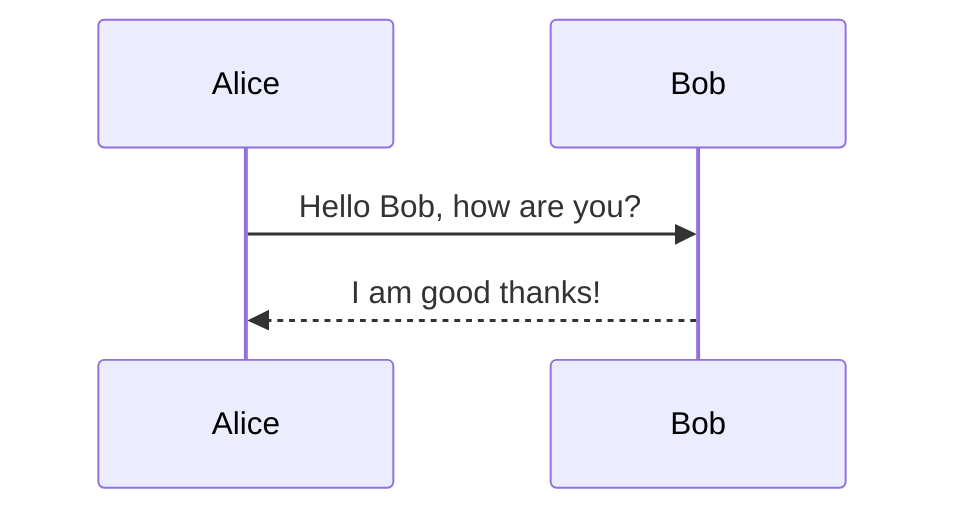
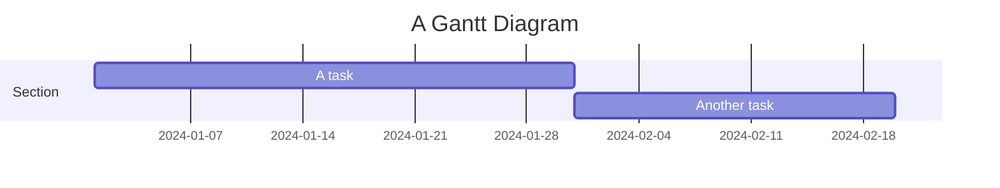
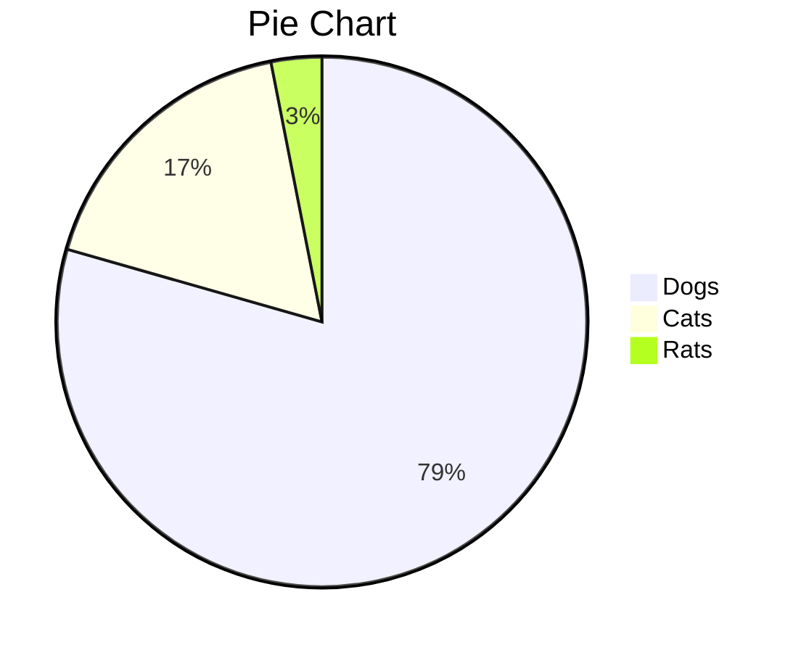

# Mermaid Display Application

A production-ready web application for displaying interactive Mermaid diagrams, designed for ProductGPT integration and GitHub Pages hosting.

## 🚀 Live Demo

Once deployed to GitHub Pages, the application will be available at:
`https://pulsepointinc.github.io/product/mermaid/`

## 📋 Features

### Core Functionality
- **URL Parameter Support**: Accept Mermaid markup via URL parameters
- **Interactive Rendering**: Real-time Mermaid diagram rendering
- **Dual View**: Toggle between rendered diagram and source code
- **Error Handling**: Comprehensive error messages for invalid markup

### Export Options
- **PNG Export**: High-resolution image export for diagrams and charts
- **CSV Export**: Data extraction and export for tabular content
- **Excel Export**: Spreadsheet export with proper formatting

### Supported Diagram Types
- Flowcharts and Graph diagrams
- Sequence diagrams
- Gantt charts
- Pie charts
- Class diagrams
- Tables (with export functionality)

### User Experience
- **Professional UI**: Clean, modern interface suitable for business use
- **Mobile Responsive**: Optimized for all device sizes
- **Example Gallery**: Pre-built examples for quick testing
- **Keyboard Shortcuts**: Ctrl/Cmd+Enter to render, Ctrl/Cmd+S to export
- **Auto URL Updates**: Share diagrams via URL with encoded parameters

## 🔗 URL Format

### Basic Usage
```
https://pulsepointinc.github.io/product/mermaid/?diagram=[encoded-mermaid-markup]
```

### Example URLs

**Flowchart Example:**
```
https://pulsepointinc.github.io/product/mermaid/?diagram=flowchart%20TD%0A%20%20%20%20A%5BStart%5D%20--%3E%20B%7BDecision%7D%0A%20%20%20%20B%20--%3E%7CYes%7C%20C%5BAction%201%5D%0A%20%20%20%20B%20--%3E%7CNo%7C%20D%5BAction%202%5D
```

**Pie Chart Example:**
```
https://pulsepointinc.github.io/product/mermaid/?diagram=pie%20title%20Budget%20Allocation%0A%20%20%20%20%22Development%22%20%3A%2045%0A%20%20%20%20%22Design%22%20%3A%2020%0A%20%20%20%20%22Marketing%22%20%3A%2015
```

## 🛠 Technical Specifications

### Dependencies
- **Mermaid.js** v10.6.1 - Diagram rendering engine
- **html2canvas** v1.4.1 - PNG export functionality
- **SheetJS** v0.18.5 - Excel export functionality

### Browser Support
- Chrome/Chromium 80+
- Firefox 75+
- Safari 13+
- Edge 80+

### Performance
- Lightweight: ~2MB total load (including all dependencies)
- Fast rendering: Client-side processing
- Responsive: Mobile-optimized interface

## 📖 Usage Examples

### For ProductGPT Integration

ProductGPT can generate links dynamically:

```javascript
// Example: Generate a flowchart URL
const mermaidCode = `
flowchart TD
    A[User Request] --> B{Valid Input?}
    B -->|Yes| C[Process Request]
    B -->|No| D[Return Error]
    C --> E[Generate Response]
    D --> F[End]
    E --> F
`;

const encodedDiagram = encodeURIComponent(mermaidCode);
const url = `https://pulsepointinc.github.io/product/mermaid/?diagram=${encodedDiagram}`;
```

### Manual Usage

1. **Direct Input**: Visit the application and enter Mermaid markup in the textarea
2. **URL Parameters**: Access diagrams via URL with encoded parameters
3. **Examples**: Use the built-in example gallery for quick testing

## 🔧 Deployment to GitHub Pages

### Prerequisites
- GitHub repository with Pages enabled
- Files placed in the correct directory structure

### Setup Steps

1. **Create Directory Structure**:
   ```
   /product/mermaid/
   ├── index.html
   └── README.md
   ```

2. **Enable GitHub Pages**:
   - Go to repository Settings
   - Navigate to Pages section
   - Select source branch (usually `main`)
   - Set folder to `/` (root) or `/docs` depending on structure

3. **Access Application**:
   - URL: `https://[username].github.io/[repository]/mermaid/`
   - For PulsePoint: `https://pulsepointinc.github.io/product/mermaid/`

### File Structure for Deployment
```
repository-root/
├── mermaid/
│   ├── index.html          # Main application
│   └── README.md           # Documentation
└── other-files...
```

## 🎯 Use Cases

### Business Applications
- **Process Documentation**: Flowcharts for business processes
- **Project Planning**: Gantt charts for project timelines
- **Data Visualization**: Pie charts for budget allocations
- **System Architecture**: Class diagrams for software design
- **Communication Flow**: Sequence diagrams for API interactions

### ProductGPT Integration
- **Dynamic Diagram Generation**: Generate diagrams based on user queries
- **Shareable Links**: Create persistent URLs for generated diagrams
- **Export Options**: Allow users to download diagrams in various formats
- **Interactive Exploration**: Let users modify and re-render diagrams

## 🔍 Troubleshooting

### Common Issues

**Diagram Not Rendering:**
- Check Mermaid syntax validity
- Ensure proper URL encoding for parameters
- Verify browser JavaScript is enabled

**Export Not Working:**
- Ensure diagram is rendered before export
- Check browser popup/download permissions
- Verify sufficient browser memory for large diagrams

**URL Parameter Issues:**
- Use proper URL encoding (`encodeURIComponent()`)
- Check for special characters in diagram code
- Verify parameter format: `?diagram=...`

### Browser Console
Check the browser developer console for detailed error messages if issues occur.

## 📝 Mermaid Syntax Reference

### Flowchart


### Sequence Diagram


### Gantt Chart


### Pie Chart


## 🤝 Contributing

This application is designed for ProductGPT integration. For issues or feature requests, please contact the development team.

## 📄 License

Internal use for PulsePoint Inc. projects.

---

**Version**: 1.0.0  
**Last Updated**: September 2024  
**Maintained by**: PulsePoint Development Team